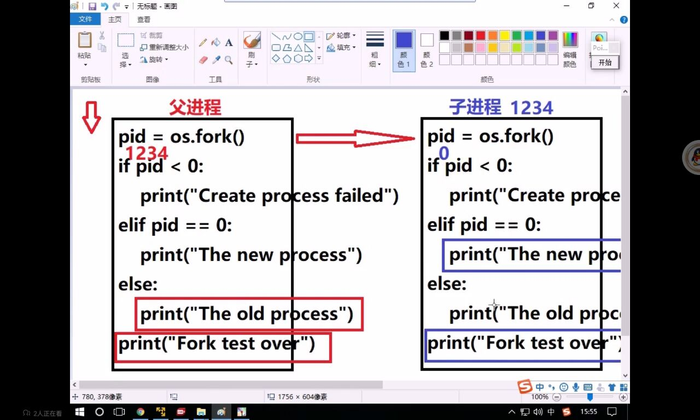

# 网络基础概念

##### IP地址
> 功能：确定一台主机的网络路由位置
> 查看本机网络地址命令：ifconfig(linux)、ipconfig(Windows)

> 结构：
> ipv4 点分十进制表示  172.40.91.185 每一个部分取值范围0~255
> ipv6 128位 扩大了地址范围

注意：
> 在同一局域网内的ip都各不相同

##### 域名
> 定义：给网络服务器地址起的名字
> 作用：方便记忆，表达一定的含义
> ping [ip]：测试和某个主机是否联通

##### 端口号
> 作用：端口号是网络地址的一部分，用于区分主机上不同的网络应用程序
> 特点：一个系统中的应用监听的端口号不能重复
> 取值范围：1~65535
>> 1~1023 系统应用或者大众程序监听端口
>> 1024~65535 自用端口，推荐使用10000以上的

# 传输层服务

## 面向连接的传输服务(基于TCP协议的数据传输)
1、传输特征：提供了可靠的数据传输
2、实现手段：在通信前建立数据连接，通信结束要断开
> 三次握手
> > 客户端向服务器发送消息报文请求连接
> > 服务器收到请求后，回复报文确定可以连接
> > 客户端收到回复，发送报文建立连接

## 面向无连接的传输服务(基于UDP协议的数据传输)
1、传输特点：不保证传输的可靠性
2、适用情况：网络较差，对传输可靠性要求不高

# socket套接字编程

## 套接字介绍

1、套接字：实现网络编程进行数据传输的一种技术手段
2、Python实现套接字编程：import socket
3、套接字分类:
> 流式套接字(SOCK——STREAM)：以字节流传输数据，实现tcp网络传输

> 数据报套接字(SOCK_DGRAM)：以数据报形式传输数据，实现udp网络传输

# tcp套接字编程

## 服务端流程

> 1、socket -- 创建套接字
> 2、bind -- 绑定地址
> 3、listen -- 监听
> 4、accept -- 等待客户端连接
> 5、send/recv -- 沟通
> 6、close -- 结束

***1、创建套接字***

```
sockfd=socket.socket(socket_family=AF_INET,socket_type=SOCK_STREAM,proto=0)
功能：创建套接字
参数：
    socket_family：   网络地址类型 AF_INET表示ipv4
    socket_type： SOCK_STREAM(流式)、SOCK_DGRAM（数据包）
    proto：   通常为0   选择子协议
返回值：套接字对象
```

***2、绑定地址***
> 本地地址：'localhost','127.0.0.1' -- 别人计算机的客户端访问不来了，只有本机的客户端是可以
> 网络地址：'192.168.79.140' -- 别人和自己都必须通过192.168.79.140这个地址来访问
> 自动获取地址：'0.0.0.0' -- 别人通过192.168.79.140访问
```
sockfd.bind(addr)
功能：绑定本机网络地址
参数：二元元组（ip,port）('0.0.0.0',8888)
```

***3、设置监听***
```
sockfd.listen(n)
功能：将套接字设置为监听套接字，n是确定监听队列的大小
参数：监听队列的大小
```

***4、等待处理客户端连接请求***
```
connfd,addr = sockfd.accept()
功能：阻塞等待处理客户端请求
返回值：connfd：客户端连接套接字
       addr：链接的客户端地址
```

***5、消息收发***
```
data = connfd.recv(buffersize)
功能：接受客户端消息
参数：每次接受消息的大小
返回值：接受到的内容

n = connfd.send(data) 
功能：发送消息
参数：要求发送的内容 bytes格式
返回值：发送的字节shu
```
> encode() 将字符串转化为字节穿
> decode() 将字节串转化为字符串

***6、关闭套接字***
```
sockfd.close()
功能：关闭套接字
```

##### 代码
```
import socket

# 创建tcp套接字
sockfd = socket.socket(socket.AF_INET,socket.SOCK_STREAM)

# 绑定地址
sockfd.bind(('0.0.0.0',8888))

# 设置监听
sockfd.listen(5)

# 阻塞等待链接
print("Wait for connect...")
connfd,addr = sockfd.accept()
print(f"Connect form {addr} ...")

# 收发消息
data = connfd.recv(1024)
print(f"收到：{data}")
connfd.send(b'Thanks')

# 关闭套接字
connfd.close()
sockfd.close()
```
注意：
> 服务端绑定地址也要正确

##　客户端流程

> 1、socket -- 创建套接字
> 2、bind -- 绑定地址(可选)
> 3、connect -- 连接
> 5、send/recv -- 沟通
> 6、close -- 结束

***1、创建套接字***
> 注意：只有相同的套接字才能进行通信

***2、请求连接***
```
sockfd.connect(server_addr)
功能：连接服务器
参数：元组  服务器地址
```

***3、收发消息***
> 注意：防止两段都阻塞，recv，send要配合

***4、关闭套接字***
> sockfd.close()

代码：
```
from socket import *

# 创建tcp套接字
sockfd = socket() # 使用默认参数 -> tcp套接字

# 连接
sockfd.connect(('127.0.0.1',8888))

# 收发消息
data = input("Msg>>")
sockfd.send(data.encode())
data = sockfd.recv(1024)
print("Server:",data.decode())

# 关闭
sockfd.close()
```

注意：
> 客户端连接服务端的时候一定要确保连接地址正确


##### 注意
> 客户端断开连接时，会给服务器端发送一个null

#### 客户端循环发送消息
```
# 收发消息
while True:
    data = input("Msg>>")
    if not data:
        break
    sockfd.send(data.encode())
    data = sockfd.recv(1024)
    print("Server:",data.decode())
```
#### 服务端循环接受消息
```
# 收发消息
while True:
    # 阻塞等待链接
    print("Wait for connect...")
    connfd,addr = sockfd.accept()
    print(f"Connect form {addr} ...")

    while True:
        data = connfd.recv(1024)
        if not data:
           break
        print(f"收到：{data.decode()}")
        connfd.send(b'Thanks')
    connfd.close()
```

#### 网络收发缓冲区
当网络缓冲区里面没内容的时候recv才会阻塞
> 1、网络缓冲区有效的协调了消息的收发速度
> 2、send和recv实际是向缓冲区发送接受消息，当缓冲区不为空recv就不会阻塞

#### tcp粘包
> 原因：tcp以字节流的方式传输，没有消息边界。多次发送的消息被一次接受，此时就会形成粘包。

> 影响：如果每次发送内容都是一个独立的含义，需要接受端独立解析此时粘包会有影响

> 处理方法:
> > 1、人为的添加消息边界
> > 2、控制发送速度

# UDP套接字编程

## 服务端流程
> 1、socket -- 创建套接字
> 2、bind -- 绑定地址
> 3、recvfrom -- 接受  
> 4、sendto -- 发送
> 5、close -- 关闭套接字

***1、创建数据报套接字***
```
sockfd = socket(AF_INET,SOCK_DGRAM)
```

***2、绑定地址***
```
sockfd.bind(addr)
```

***3、消息收发***
```
data,addr = sockfd.recvfrom(buffersize)
功能：接受udp消息
参数：每次接受多少字节
返回值：data    接受到的内容
       addr    目标地址

n = sockfd.sento(data,addr)
功能：发送udp消息
参数：data 发送的内容
    addr 目标地址
返回值：发送的字节数
```

***4、关闭套接字***
```
sockfd.close()
```

代码：
```
from socket import *

# 创建套接字
sockfd = socket(AF_INET,SOCK_DGRAM)

# 绑定地址
sockfd.bind(('0.0.0.0',8888))

# 收发消息
while True:
    data,addr = sockfd.recvfrom(1024)
    print(data.decode())
    sockfd.sendto(b"Thanks",addr)
    
# 关闭套接字
sockfd.close()
```

## 服务端流程
> 1、socket -- 创建套接字
> 3、sendto -- 发送
> 4、recvfrom -- 接受  
> 5、close -- 关闭套接字

注：数据报消息传输有消息边界，不会产生粘包问题

# socket套接字属性
> sockfd.type -- 套接字类型(流式、数据报)
> sockfd.family -- 套接字的地址类型(ipv4、ipv6)
> sockfd.getsockname() -- 获取绑定地址
> sockfd.fileno() -- 文件描述符
> sockfd.getpeername() -- 连接端地址(连接套接字可以使用)

> sockfd.setsockopt(level,option,value)
```
功能：设置套接字选项 SOL_SOCKET
参数：level 选择类别
    option 具体选项内容
    value 选项值
sockfd.setsockopt(SOL_SOCKET,SO_REUSEADDR,1) # 当意外断开，绑定的端口会被立刻回收
```

# UDP套接字广播
brodcast: 广播地址

> ·广播定义：一端发送多点接受
> ·广播地址：每个网络的最大地址为发送广播的地址，向该地址发送，则网段所有主机都能接收

# TCP套接字之HTTP传输

## HTTP协议（超文本传输协议）
1、用途：网页获取，数据传输
2、特点
3、网页请求过程
> 1、客户端(浏览器)通过tcp传输，发送http请求给服务端
> 2、服务端接受到http请求后进行解析
> 3、服务端处理请求内容，组织响应内容
> 4、服务器将响应内容以http响应格式发送给浏览器
> 5、浏览器接受到响应内容，解析展示


### HTTP请求(request)

***1、请求行***
具体的请求类别和请求内容
```
GET         /       HTTP/1.1
请求类别    请求内容   协议版本
```
请求类别：每个请求类别表示要做不同的事情
> get: 获取网络资源
> post: 提交一定的信息，得到反馈
> head: 只获取网络资源的响应头
> put: 更新服务器资源
> delete: 删除服务器资源

***2、请求头***
对请求的进一步解释和描述
***3、空行***
***4、请求体***
请求参数或者提交内容

注：请求行和空行一定要有，另外两个可以没有

### http响应(response)
响应格式：响应行，响应头，空行，响应体

***1、响应行***
返回基本的响应情况
```
HTTP/1.1    200     OK
版本信息    响应码  附加信息
```
响应码：
> 1xx: 提示信息，表示请求被接受
> 2xx: 响应成功
> 3xx: 响应需要进一步操作，重定向
> 4xx: 客户端错误
> 5xx: 服务器错误

<a herf='http://www.javashuo.com/article/p-vtkttzmg-cp.html'>响应码介绍</a>

***2、响应头***
对响应内容的描述
***3、响应体***
响应的主体内容


##### 代码：
```
响应行：response = "HTTP/1.1 200 OK\r\n"    
响应头：response+="Content-Type:text/html\r\n"
空行：response+="\r\n"
响应体：response+=f.read()
```

# struct模块的使用
##### 1、原理：
>将一组简单数据进行打包。转换为bytes格式发送。或者将一组bytes格式数据，进行解析

> 可以在不同语言之间通信

##### 2、接口使用
```
Struct(fmt)
功能：生成结构化数据
参数：fmt   定制数据结构

st.pack(v1,v2,v3...)
功能：将一组数据按照指定格式打包转换为bytes
参数：要打包的数据
返回值：bytes字节串

st.unpack(bytes_data)
功能：将bytes字节串按照指定的格式解析
参数：要解析的字节串
返回值：解析后的内容
```
代码实例：
```
import struct
st = struct.Struct('i4sf') # 第一个为整形，第二个为四个字节串，第三个是浮点型
data = st.pack(1,b'asdd',1.25)
# 结果：b'\x01\x00\x00\x00sssd33\xd3?'
```

# 多任务编程
1.意义：充分利用计算机多核资源，提高程序的运行效率
2.实现方案：多进程，多线程
3.并行与并发

> 并发：同事处理多个任务，内核在任务间不断的切换达到好像多个任务被同时执行的效果，实际每个时刻只有一个任务占有内核
> 并行：多个任务利用计算机的多核资源在同事执行，此时多个任务间为并行关系

注：并发对于IO密集型程序(等待的时间多)能很好的提高效率，对计算密集型程序的效率提高的比较低。
# 进程

##　进程理论基础
***1、定义：程序在计算中的一次进程***
> ·程序是一个可执行，是静态的占有磁盘
> ·进程是一个动态的过程描述，占用计算机运行资源，有一定的生命周期。

***2、系统中如何产生一个进程***

> 1.用户空间通过调用程序接口或者命令发起请求
> 2.操作系统接收用户请求，开始创建进程
> 3.操作系统调配计算机资源，确定进程状态
> 4.操作系统将创建的进程提供给用户使用

***3、进程基本概念***

> ·cpu时间片：如果一个进程占有cpu内核，则称这个进行在CPU时间片上。
> ·PCB(进程控制块)：在内存中开辟一块空间，用于存放进程的基本信息，也用于系统查找识别进程。
> ·进程ID(PID)：系统为每个进程分配的一个大于0的整数作为进程ID。每个进程ID不重复
> > linux查看进程ID的命令：ps -aux
> ·父子进程：系统中每个进程（除了系统初始化进程）都有唯一的父进程，可以有0个或者多个子进程。父子进程关系便于进程管理
> > 查看进程树：pstree

***4、进程状态***
· 三态
> 就绪态：进程具备执行条件，等待分配cpu资源
> 执行态：进程占有cpu时间片正在运行
> 阻塞等待态：进程暂时停止运行，让出CPU

·五态(在三态的基础上增加新建和终止)
> 新建：创建一个进程，获取资源的过程
> 终止：进程结束，释放资源的过程


***5、进程的运行特征***
> 1.进程可以使用计算机多核资源
> 2、进程是计算机分配资源的最小单位
> 3、进程之间的运行互不影响，各自独立
> 4、**每个进程拥有独立的空间，各自使用自己的空间资源**

# 基于fork的多进程编程

**pid = os.fork()**
> 功能：创建新的进程
> 返回值：整数，如果创建进程失败返回一个负数，如果成功则在原有的进程中返回新进程PID，在新进程中返回0


> 子进程是从fork语句的下一条语句开始执行



代码：
```
import os
pid = os.fork()
if pid<0:
    print("创建失败")
elif pid == 0:
    print("这是新进程")
else:
    print('这个是老进程')
```

注意：
> ·子进程会复制父进程全部内存空间，从fork下一句开始执行
> ·父子进程各自独立运行，运行顺序不一定
> ·利用父子进程fork返回值的区别，配合if结构让父子进程执行不同的内容几乎是固定搭配
> ·父子进程各自有个自的特征比如PID，PCB命令集等
> ·父进程fork之前开辟的空间子进程同样拥有，父子进程对各自空间的操作不会相互影响

# 进程相关函数
> os.getpid()
> 功能：获取一个进程的pid值
> 返回值：当前进程的pid

> os.getppid()
> 功能：获取父进程的pid
> 返回值：父进程的pid值

> os._exit(status)
> 功能：结束一个进程
> 参数：进程的终止状态

> sys.exit([status])
> 功能：退出进程
> 参数：整数 表示退出状态
> 字符串 表示退出时打印内容

注意：
> ·父子进程的退出不会影响另一个

***1、孤儿进程***
> 如果一个进程的父进程先结束了，那么子进程会被系统派出的专有进程收养。这就是孤儿进程的产生。

***2、僵尸进程***
> 子进程先于父进程退出，父进程又没有处理子进程的退出状态，此时子进程就会变成僵尸进程。

> 特点：僵尸进程虽然结束，但是会存留部分pcb在内存中，大量的僵尸进程会浪费系统的内存资源

***3、如何避免僵尸进程产生***
###### 使用wait函数处理子进程退出
```
pid,status = os.wait()
功能：在父进程中阻塞等待处理子进程退出
返回值：pid 退出的子进程的pid
       status 子进程的退出状态*256
```

###### 创建二级子进程处理僵尸
> 1、父进程创建子进程，等待回收子进程
> 2、子进程创建二级子进程然后退出
> 3、二级子进程成为孤儿进程，执行事件

```
pid = os.fork()
if pid == 0:    #一级子进程
    p = os.fork()
    if p == 0:  #二级子进程
        执行事件2
    else:
        sys.exit()  #退出一级子进程
else:   #父进程
    执行事件1
```

###### 通过信号处理子进程退出
> 原理：子进程退出时会发送信号给父进程，如果父进程忽略子进程信号，则系统就会自动处理子进程退出.
> 方法：使用signal模块在父进程创建子进程前写如下语句

```
import signal
signal.signal(signal.SIGCHLD,signal.SIG_IGM)
```
> 特点：非阻塞，不会影响父进程运行，可以处理所有子进程退出

# 完成群聊聊天室
