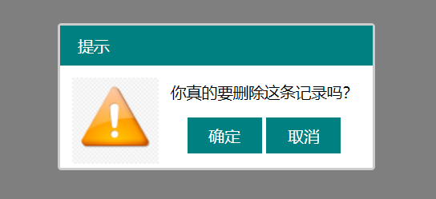
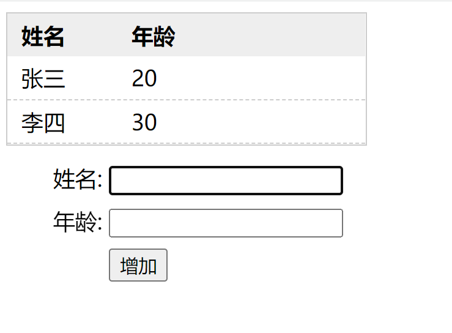
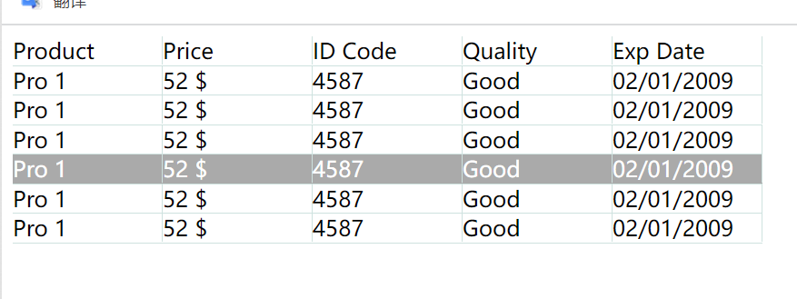

# 1、弹窗
```html
<!DOCTYPE html>
<html lang="en">
<head>
    <meta charset="UTF-8">
    <meta http-equiv="X-UA-Compatible" content="IE=edge">
    <meta name="viewport" content="width=device-width, initial-scale=1.0">
    <title>Document</title>
    <style>
        body{
            font-size: 13px;
        }
        #bg{
            position: absolute;
            top: 0;
            left: 0;
            width: 100%;
            height: 100%;
            background-color: rgba(0, 0, 0,0.5);
            display: none;
        }
        #box{
            border: solid 2px #ccc;
            width: 260px;
            margin: 0 auto;
            position: absolute;
            z-index: 2;
            left: 50%;
            top: 50%;
            margin-left: -130px;
            margin-top: -80px;
            display: none;
            border-radius: 3px;
        }
        #box .title{
            color: #fff;
            background-color: #008081;
            padding: 8px 15px;
        }
        #box .con{
            overflow: hidden;
            /* border: solid 1px red; */
            background-color: #fff;
        }
        #box .con .img{
            float: left;
            margin: 10px 10px 0px 10px;
        }
        #box .con .rright{
            float: left;
        }
        #box .con .rright .btn{
            text-align: center;
            
        }
        #box .con .rright .btn button{
            background-color: #008081;
            width: 62px;
            height: 30px;
            border: none;
            color: #fff;
        }

    </style>
</head>
<body>
    <button id="btnShow">弹框</button>
    <div id="bg"></div>

    <div id="box">
        <div class="title">提示</div>
        <div class="con">
            <div class="img">
                
            </div>
            <div class="rright">
                <p>你真的要删除这条记录吗？</p>
                <div class="btn">
                    <button id="sure">确定</button>
                    <button id="close">取消</button>
                </div>
            </div>
        </div>
    </div>

    <script>
        var btnShow=document.getElementById('btnShow');
        var divBg = document.getElementById('bg');
        var divBox = document.getElementById('box');
        var btnSure = document.getElementById('sure');
        var btnClose = document.getElementById('close');
        btnShow.onclick=function(){
            divBg.style.display='block';
            divBox.style.display='block';
        }
        btnClose.onclick=function(){
            divBg.style.display='none';
            divBox.style.display='none';
            // 其他动作
            pass;
        }
        btnSure.onclick=function(){
            divBg.style.display='none';
            divBox.style.display='none';
            // 其他动作
            pass;
        }
    </script>
</body>
</html>
```
> 效果图



# 2、表
> 点击添加可以更新表格内容
```html
<!DOCTYPE html>
<html lang="en">
<head>
    <meta charset="UTF-8">
    <meta http-equiv="X-UA-Compatible" content="IE=edge">
    <meta name="viewport" content="width=device-width, initial-scale=1.0">
    <title>Document</title>
    <style>
        ul{
            list-style-type: none;
            margin: 0;
            padding: 0;
            width: 260px;
            border: solid 1px #ccc;
        }
        ul>li:nth-child(1){
            font-weight: 700;
            background-color: #eee;
        }
        ul>:not(li:nth-child(1)){
            border-bottom: dashed 1px #ccc;
        }
        ul>li{
            padding: 5px 10px;
        }
        ul>li>span{
            display: inline-block;
            width: 80px;
        }

        #add{
            padding: 5px 10px;
        }

        #add>div>span{
            display: inline-block;
            width: 60px;
            text-align: right;
        }
        #add>div{
            margin-top: 8px;
        }
    </style>
</head>
<body>
    <div id="stu">
        <ul id="ul">
            
        </ul>
    </div>

    <div id="add">
        <div>
            <span>姓名:</span>
            <input type="text" id="name">
        </div>
        <div>
            <span>年龄:</span>
            <input type="text" id="age">
        </div>
        <div>
            <span></span>
            <button id="append">增加</button>
        </div>
    </div>

    <script>
        // 定义一个数组
        var stu = [ 
                    {name:'张三',age:20},
                    {name:'李四',age:30}
                  ];
                  
        // 读取数组元素
        function show(){
            var HTML='<li><span>姓名</span><span>年龄</span></li>';
            for(var i=0;i<stu.length;i++){
                HTML+='<li>';
                HTML+='<span>'+stu[i].name+'</span>';
                HTML+='<span>'+stu[i].age+'</span>';
                HTML+='</li>';     
            }
            document.getElementById('ul').innerHTML=HTML;
        }
        
        show();

        var btnAdd = document.getElementById('append');
        var inName = document.getElementById('name');
        var inAge = document.getElementById('age');
        btnAdd.onclick=function(){
            var obj={};
            obj.name=inName.value;
            obj.age=inAge.value;
            stu.push(obj);
            show();
        }
    </script>
</body>
</html>

```
效果


# 高亮显示

鼠标所在行会高亮显示
```html
    <!DOCTYPE html>
<html lang="en">
<head>
    <meta charset="UTF-8">
    <meta http-equiv="X-UA-Compatible" content="IE=edge">
    <meta name="viewport" content="width=device-width, initial-scale=1.0">
    <title>Document</title>
    <style>
        ul{
            width: 550px;
            list-style-type: none;
            padding: 0;
            margin: 0;
        }
        ul>li{
            border-bottom: solid 1px #cee2df;
            overflow: hidden;
        }
        ul>li>span{
            width: 109px;
            float: left;
            border-right: solid 1px #cee2df;
        }
    </style>
    <script src="../code/js/jquery-3.6.0.min.js"></script>

</head>
<body>

    <ul>
        <li><span>Product</span><span>Price</span><span>ID Code</span><span>Quality</span><span>Exp Date</span></li>
        <li><span>Pro 1</span><span>52 $</span><span>4587</span><span>Good</span><span>02/01/2009</span></li>
        <li><span>Pro 1</span><span>52 $</span><span>4587</span><span>Good</span><span>02/01/2009</span></li>
        <li><span>Pro 1</span><span>52 $</span><span>4587</span><span>Good</span><span>02/01/2009</span></li>
        <li><span>Pro 1</span><span>52 $</span><span>4587</span><span>Good</span><span>02/01/2009</span></li>
        <li><span>Pro 1</span><span>52 $</span><span>4587</span><span>Good</span><span>02/01/2009</span></li>
        <li><span>Pro 1</span><span>52 $</span><span>4587</span><span>Good</span><span>02/01/2009</span></li>
    </ul>


    <script>
        //each
        $('ul>li:not(li:first)').each(function(index,elem){
            // 将每一项转化为jq对象
            $(elem).on("mouseover",function(){
                $(this).css({"background-color":"#aaa","color":"#fff"});
            }).on("mouseout",function(){
                $(this).css({"background-color":"#fff","color":"#000"});
            })
        })
    </script>
</body>
</html>
```

效果


